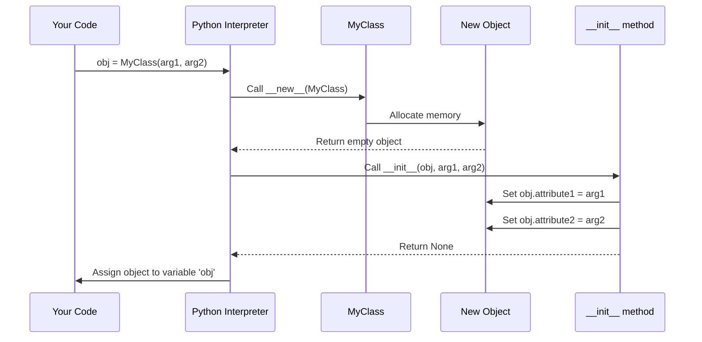
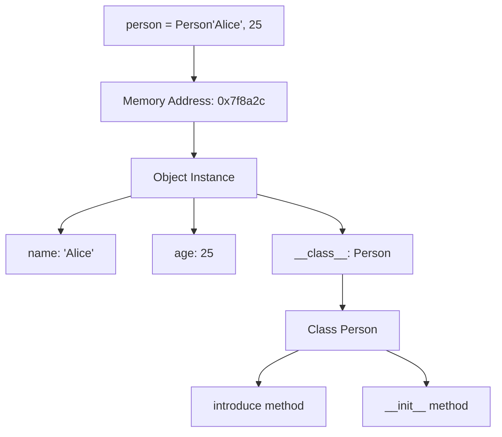

# Lesson 01: Classes and Objects

## 📚 Concept

Classes are blueprints for creating objects in Python. When you define a class, you're creating a template that describes what data (attributes) and behaviors (methods) objects of that type will have. Objects are instances of classes - actual entities created from the blueprint. Think of a class as a cookie cutter and objects as the cookies made from it.

## 🎯 Key Points

- A **class** is a blueprint that defines structure and behavior
- An **object** is an instance created from a class blueprint
- **Instance attributes** are unique to each object (like `self.name`)
- **Class attributes** are shared across all instances (like `BankAccount.bank_name`)
- The `__init__` method is called automatically when creating an object to initialize it

## 💡 When to Use

- **Modeling real-world entities**: Create a `User` class for user accounts, `Product` class for inventory items
- **Organizing related data and functions**: Group customer data with methods like `calculate_discount()` or `send_email()`
- **Creating reusable components**: Build a `DatabaseConnection` class that can be instantiated multiple times with different configurations

## 🔍 Example Overview

The `example.py` demonstrates progressive complexity in working with classes and objects:

- **Example 1**: Basic class with a simple method
- **Example 2**: Constructor with instance attributes
- **Example 3**: Class attributes vs instance attributes
- **Example 4**: Real-world product inventory system

## 🎬 What Happens Behind the Scenes?

When you write `obj = MyClass(arg1, arg2)`, Python performs several steps:



### Step-by-Step Breakdown

Let's trace what happens with `person = Person("Alice", 25)`:

1. **Python looks up the class**: Finds the `Person` class definition in memory
2. **Allocates memory**: Python's `__new__` method creates an empty object in memory
3. **Returns empty object**: The new object is created but has no attributes yet
4. **Calls `__init__`**: Python automatically calls `Person.__init__(empty_object, "Alice", 25)`
5. **Initializes attributes**: Inside `__init__`, `self.name = "Alice"` and `self.age = 25` are set
6. **Returns the object**: The fully initialized object is assigned to the variable `person`

### Memory Perspective



Each object gets:
- **Unique memory address**: `id(person)` returns this
- **Instance namespace**: Dictionary storing `name` and `age`
- **Reference to class**: Link back to `Person` class for accessing methods

## 🚀 Run the Example

```bash
python lessons/01_classes_and_objects/example.py
```

## 📖 Further Reading

- [Python Classes Documentation](https://docs.python.org/3/tutorial/classes.html)
- [Python Data Model - Object Creation](https://docs.python.org/3/reference/datamodel.html#object.__new__)
- **Real-world usage**: Django ORM models, SQLAlchemy models, dataclasses all use class-based object creation
