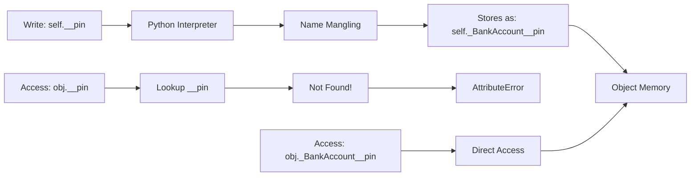
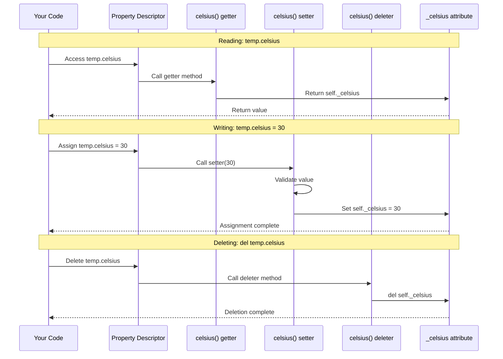
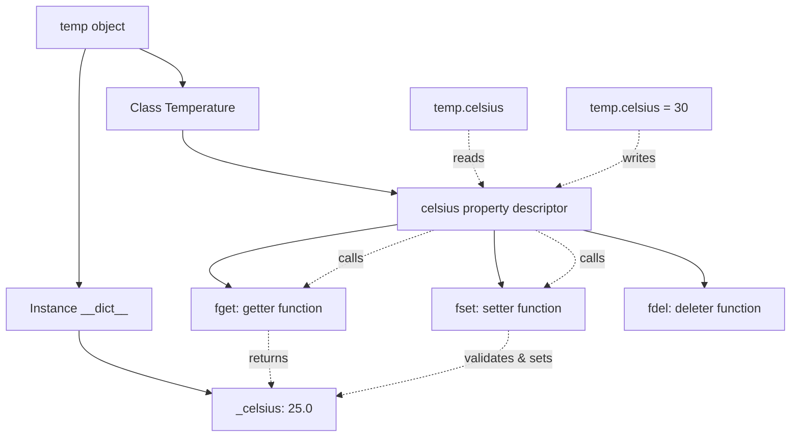

# Lesson 02: Encapsulation

## 📚 Concept

Encapsulation is the practice of bundling data (attributes) and methods that operate on that data within a class, while controlling access to prevent direct modification. Python uses naming conventions (`_protected`, `__private`) and the `@property` decorator to implement encapsulation. Unlike languages like Java or C++, Python's approach is based on trust and convention rather than strict enforcement - following the philosophy "we're all consenting adults here."

## 🎯 Key Points

- **Public attributes** (`self.name`) are accessible anywhere
- **Protected attributes** (`self._name`) signal "internal use" but aren't enforced
- **Private attributes** (`self.__name`) use name mangling to `_ClassName__name`
- **Properties** (`@property`) provide Pythonic getters/setters with validation
- **Name mangling** prevents accidental conflicts, not malicious access
- The `@property` decorator makes methods look like attributes while adding logic

## 💡 When to Use

- **Data validation**: Use `@property` with setters to validate email formats, age ranges, or temperature limits before storing
- **Computed attributes**: Create read-only properties like `circle.area` that calculate values on-the-fly
- **API stability**: Hide internal implementation details so you can change `_internal_data` without breaking external code
- **Access control**: Use private methods (`__log_transaction`) for internal operations that shouldn't be called externally

## 🔍 Example Overview

The `example.py` demonstrates encapsulation techniques:

- **Example 1**: Public, protected, and private attributes with name mangling
- **Example 2**: Property decorators for getters/setters with validation
- **Example 3**: Read-only computed properties
- **Example 4**: Real-world user account with email/age validation
- **Example 5**: Public, protected, and private methods

## 🎬 What Happens Behind the Scenes?

### Name Mangling Process

When you use double underscores for private attributes, Python transforms the name:



**Pattern**: `instance._<ClassName>__<private_attr>`

**Example**: `self.__pin` becomes `self._BankAccount__pin`

### Property Decorator Mechanism

The `@property` decorator transforms methods into descriptors that intercept attribute access:



### Property Decorator Patterns

**1. Getter Only (Read-only)**
```python
@property
def area(self) -> float:
    return 3.14159 * self._radius ** 2

# Usage: value = circle.area
# Cannot set: circle.area = 100  # AttributeError
```

**2. Getter + Setter (Read-write with validation)**
```python
@property
def celsius(self) -> float:
    return self._celsius

@celsius.setter
def celsius(self, value: float) -> None:
    if value < -273.15:
        raise ValueError("Below absolute zero!")
    self._celsius = value

# Usage: temp.celsius = 25  # Validated!
```

**3. Getter + Setter + Deleter (Full control)**
```python
@property
def email(self) -> str:
    return self._email

@email.setter
def email(self, value: str) -> None:
    if "@" not in value:
        raise ValueError("Invalid email")
    self._email = value

@email.deleter
def email(self) -> None:
    print("Deleting email")
    del self._email

# Usage: del user.email  # Calls deleter
```

### Step-by-Step: Property Access

When you write `temp.celsius = 30`:

1. **Python sees assignment** to `celsius` attribute
2. **Checks for descriptor** - finds `@property` decorator
3. **Calls setter method** - `celsius.setter(temp, 30)`
4. **Runs validation** - checks if `30 < -273.15`
5. **Stores value** - sets `self._celsius = 30`
6. **Returns control** to your code

### Memory Structure



**Key insight**: The actual data is stored in `_celsius`, but access goes through the property descriptor which calls your getter/setter methods.

### Understanding fget, fset, fdel

When you use `@property`, Python creates a property object with three function attributes:

- **fget** (function get): The getter function that returns the value
- **fset** (function set): The setter function that assigns the value
- **fdel** (function delete): The deleter function that removes the attribute

**What the decorator does:**
```python
# When you write:
@property
def celsius(self) -> float:
    return self._celsius

# Python creates:
celsius = property(fget=celsius)

# When you add setter:
@celsius.setter
def celsius(self, value: float) -> None:
    self._celsius = value

# Python updates:
celsius = property(fget=celsius, fset=celsius)

# When you add deleter:
@celsius.deleter
def celsius(self) -> None:
    del self._celsius

# Python updates:
celsius = property(fget=celsius, fset=celsius, fdel=celsius)
```

**Manual property creation (equivalent):**
```python
# Instead of decorators, you could write:
def get_celsius(self) -> float:
    return self._celsius

def set_celsius(self, value: float) -> None:
    if value < -273.15:
        raise ValueError("Below absolute zero!")
    self._celsius = value

def del_celsius(self) -> None:
    del self._celsius

celsius = property(fget=get_celsius, fset=set_celsius, fdel=del_celsius)
```

The decorator syntax is just syntactic sugar that makes this cleaner and more readable!

## 🚀 Run the Example

```bash
python lessons/02_encapsulation/example.py
```

## 📖 Further Reading

- [Python Property Decorator](https://docs.python.org/3/library/functions.html#property)
- [Python Descriptor Protocol](https://docs.python.org/3/howto/descriptor.html)
- [PEP 8 - Naming Conventions](https://peps.python.org/pep-0008/#naming-conventions)
- **Real-world usage**: Django models use properties for computed fields, SQLAlchemy uses descriptors for database columns, dataclasses use `@property` for validation
