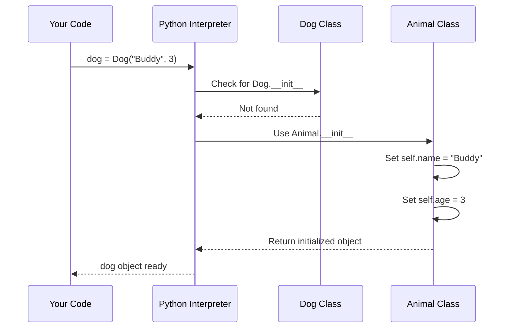
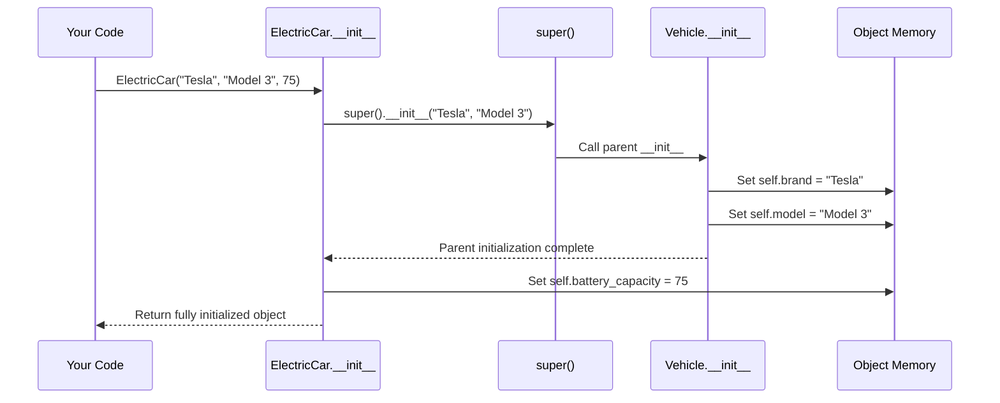
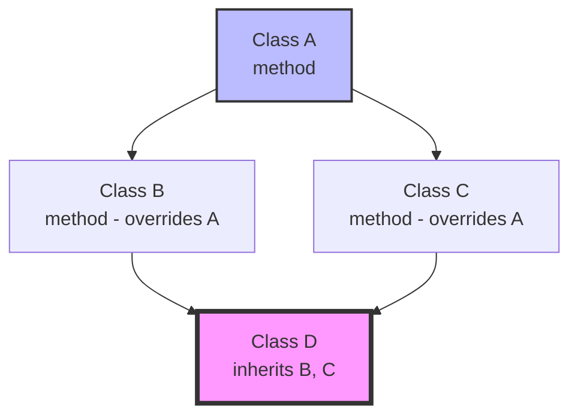
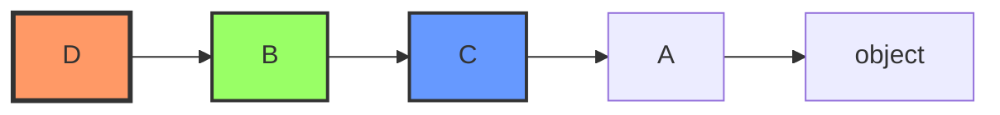
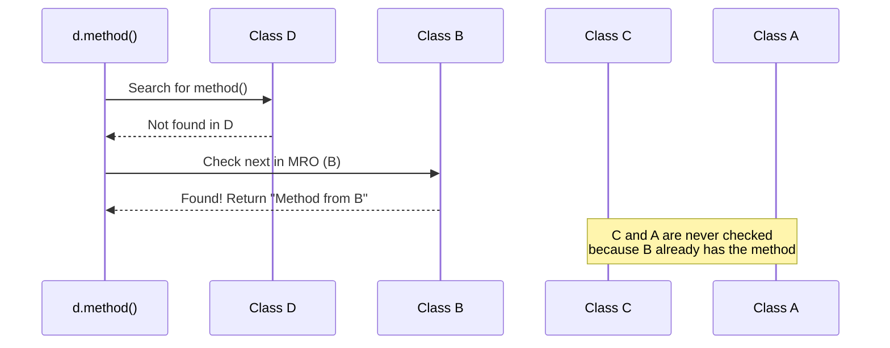
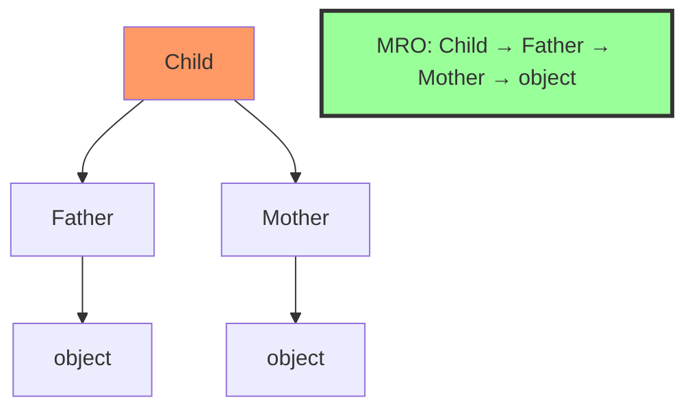
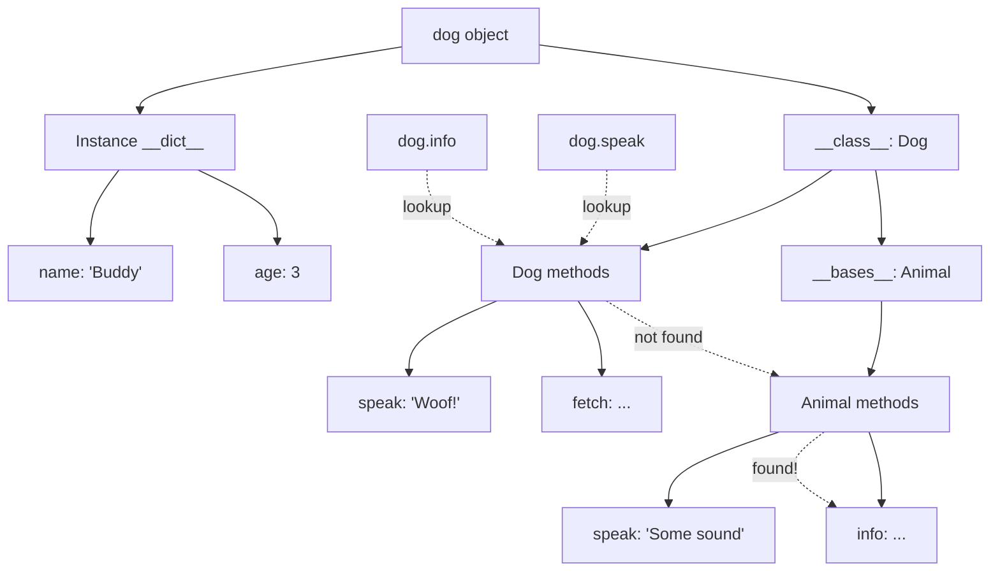

# Lesson 03: Inheritance

## 📚 Concept

Inheritance allows a class (child/subclass) to inherit attributes and methods from another class (parent/superclass), promoting code reuse and establishing hierarchical relationships. Python supports both single inheritance (one parent) and multiple inheritance (multiple parents). When multiple parents have the same method, Python uses Method Resolution Order (MRO) with the C3 Linearization algorithm to determine which method to call.

## 🎯 Key Points

- **Single inheritance**: Child class inherits from one parent (`class Dog(Animal)`)
- **Multiple inheritance**: Child class inherits from multiple parents (`class Child(Father, Mother)`)
- **Method overriding**: Child class can replace parent's method with its own implementation
- **super()**: Calls parent class methods to extend (not replace) functionality
- **MRO (Method Resolution Order)**: Determines the search order for methods in multiple inheritance
- **Automatic inheritance**: If child doesn't define `__init__`, parent's `__init__` is used automatically

## 💡 When to Use

- **Code reuse**: Create a base `Vehicle` class, then inherit for `Car`, `Truck`, `Motorcycle` without duplicating common code
- **Specialization**: Start with generic `Employee` class, then create specialized `Manager`, `Developer`, `Designer` subclasses
- **Multiple capabilities**: Use multiple inheritance like `class FlyingCar(Car, Aircraft)` to combine features from both parents
- **Framework design**: Build extensible systems where users can inherit from your base classes and customize behavior

## 🔍 Example Overview

The `example.py` demonstrates inheritance patterns:

- **Example 1**: Single inheritance - Dog inherits from Animal
- **Example 2**: Using super() - ElectricCar extends Vehicle with additional attributes
- **Example 3**: Multiple inheritance - Child inherits from both Father and Mother
- **Example 4**: MRO demonstration - Diamond problem with A, B, C, D classes
- **Example 5**: Real-world hierarchy - Person → Employee → Manager chain

## 🎬 What Happens Behind the Scenes?

### Single Inheritance: Automatic __init__ Inheritance

When a child class doesn't define `__init__`, Python automatically uses the parent's:



### Using super() for Extended Initialization

When a child class defines its own `__init__`, it must call `super().__init__()`:



**Why super() is needed:**
- Without `super().__init__()`: Parent attributes (`brand`, `model`) are NOT set
- With `super().__init__()`: Parent initializes its attributes, then child adds more

### Multiple Inheritance and MRO

The diamond problem occurs when multiple inheritance paths lead to the same base class:



**MRO Resolution:**



**Search order: D → B → C → A → object**

### Method Lookup Process

When you call `d.method()`:



### MRO Algorithm (C3 Linearization)

Python uses C3 Linearization to create MRO:

**Rules:**
1. **Child before parents**: The class itself comes first
2. **Left-to-right**: Parents are checked in the order listed
3. **Parents before grandparents**: Check immediate parents before their parents
4. **No duplicates**: Each class appears exactly once

**Example: `class Child(Father, Mother)`**



**Why this order?**
- Start with `Child` (the class itself)
- Then `Father` (first parent listed)
- Then `Mother` (second parent listed)
- Finally `object` (base of everything, appears only once)

### Memory Structure in Inheritance



**Key insight**: 
- Instance data is stored in the object's `__dict__`
- Methods are looked up through the class hierarchy
- MRO determines the search path

## 🚀 Run the Example

```bash
python lessons/03_inheritance/example.py
```

## 📖 Further Reading

- [Python Inheritance Documentation](https://docs.python.org/3/tutorial/classes.html#inheritance)
- [Method Resolution Order (MRO)](https://www.python.org/download/releases/2.3/mro/)
- [The Python 2.3 Method Resolution Order (C3)](https://www.python.org/download/releases/2.3/mro/)
- [PEP 253 - Subtyping Built-in Types](https://peps.python.org/pep-0253/)
- **Real-world usage**: Django models use inheritance for model hierarchies, unittest.TestCase is inherited for test classes, Exception classes use inheritance for error hierarchies
