# Lesson 04: Polymorphism

## 📚 Concept

Polymorphism means "many forms" - the ability to use a single interface to represent different types. In Python, polymorphism is achieved through duck typing ("if it walks like a duck and quacks like a duck, it's a duck"), method overriding in inheritance, and operator overloading with magic methods. Unlike statically-typed languages, Python doesn't check types at compile time - it only cares that objects have the required methods or behaviors.

## 🎯 Key Points

- **Duck typing**: Python checks for methods, not types - "if it has the method, it works"
- **Polymorphic functions**: One function works with many different types
- **Operator overloading**: Define how operators (`+`, `-`, `*`, `==`) work with custom classes using magic methods
- **Method overriding**: Child classes provide different implementations of parent methods
- **No traditional overloading**: Python uses default arguments and `*args` instead of multiple method signatures
- **Interface by convention**: Objects don't need to inherit from a common base - just implement the same methods

## 💡 When to Use

- **Flexible APIs**: Write `save_to_file(data)` that works with any object having a `serialize()` method
- **Plugin systems**: Create a `process()` function that works with any plugin implementing the required interface
- **Mathematical operations**: Make custom classes (Vector, Matrix, Complex) work with `+`, `-`, `*` operators naturally
- **Collections**: Build functions that work with lists, tuples, sets, or any iterable without caring about the specific type

## 🔍 Example Overview

The `example.py` demonstrates polymorphism techniques:

- **Example 1**: Duck typing - Duck, Dog, Airplane all work with same function
- **Example 2**: Polymorphism with inheritance - Different shapes with same interface
- **Example 3**: Operator overloading - Vector class with mathematical operators
- **Example 4**: Method overloading (Python style) - Using default args and `*args`
- **Example 5**: Real-world payment processing - Multiple payment methods, one interface

## 🎬 What Happens Behind the Scenes?

### Duck Typing: Runtime Method Lookup

Python doesn't check types - it just tries to call the method:


**Key insight**: Python doesn't ask "Is this a Duck?" - it asks "Does this have a speak() method?"

### Polymorphism with Different Types

```mermaid
graph TD
    A[Function: print_shape_info] --> B{Call shape.area}
    B --> C[Rectangle.area<br/>width * height]
    B --> D[Circle.area<br/>π * r²]
    B --> E[Triangle.area<br/>0.5 * base * height]
    
    C --> F[Return result]
    D --> F
    E --> F
    
    style A fill:#f96,stroke:#333,stroke-width:3px
    style F fill:#9f9,stroke:#333,stroke-width:2px
```



**Same function, different implementations** - that's polymorphism!

### Operator Overloading: Magic Methods

When you write `v1 + v2`, Python translates it to `v1.__add__(v2)`:


### Complete Magic Methods Reference

#### Arithmetic Operators
| Operator | Magic Method | Example | Description |
|----------|-------------|---------|-------------|
| `+` | `__add__(self, other)` | `a + b` | Addition |
| `-` | `__sub__(self, other)` | `a - b` | Subtraction |
| `*` | `__mul__(self, other)` | `a * b` | Multiplication |
| `/` | `__truediv__(self, other)` | `a / b` | Division |
| `//` | `__floordiv__(self, other)` | `a // b` | Floor division |
| `%` | `__mod__(self, other)` | `a % b` | Modulo |
| `**` | `__pow__(self, other)` | `a ** b` | Power |
| `@` | `__matmul__(self, other)` | `a @ b` | Matrix multiplication |

#### Reverse Arithmetic (when left operand doesn't support operation)
| Operator | Magic Method | Example | Description |
|----------|-------------|---------|-------------|
| `+` | `__radd__(self, other)` | `5 + obj` | Right-side addition |
| `-` | `__rsub__(self, other)` | `5 - obj` | Right-side subtraction |
| `*` | `__rmul__(self, other)` | `5 * obj` | Right-side multiplication |
| `/` | `__rtruediv__(self, other)` | `5 / obj` | Right-side division |

#### Comparison Operators
| Operator | Magic Method | Example | Description |
|----------|-------------|---------|-------------|
| `==` | `__eq__(self, other)` | `a == b` | Equal to |
| `!=` | `__ne__(self, other)` | `a != b` | Not equal to |
| `<` | `__lt__(self, other)` | `a < b` | Less than |
| `<=` | `__le__(self, other)` | `a <= b` | Less than or equal |
| `>` | `__gt__(self, other)` | `a > b` | Greater than |
| `>=` | `__ge__(self, other)` | `a >= b` | Greater than or equal |

#### Bitwise Operators
| Operator | Magic Method | Example | Description |
|----------|-------------|---------|-------------|
| `&` | `__and__(self, other)` | `a & b` | Bitwise AND |
| `|` | `__or__(self, other)` | `a | b` | Bitwise OR |
| `^` | `__xor__(self, other)` | `a ^ b` | Bitwise XOR |
| `~` | `__invert__(self)` | `~a` | Bitwise NOT |
| `<<` | `__lshift__(self, other)` | `a << b` | Left shift |
| `>>` | `__rshift__(self, other)` | `a >> b` | Right shift |

#### Unary Operators
| Operator | Magic Method | Example | Description |
|----------|-------------|---------|-------------|
| `-` | `__neg__(self)` | `-a` | Negation |
| `+` | `__pos__(self)` | `+a` | Positive |
| `abs()` | `__abs__(self)` | `abs(a)` | Absolute value |

#### In-place Operators (augmented assignment)
| Operator | Magic Method | Example | Description |
|----------|-------------|---------|-------------|
| `+=` | `__iadd__(self, other)` | `a += b` | In-place addition |
| `-=` | `__isub__(self, other)` | `a -= b` | In-place subtraction |
| `*=` | `__imul__(self, other)` | `a *= b` | In-place multiplication |
| `/=` | `__itruediv__(self, other)` | `a /= b` | In-place division |
| `//=` | `__ifloordiv__(self, other)` | `a //= b` | In-place floor division |
| `%=` | `__imod__(self, other)` | `a %= b` | In-place modulo |
| `**=` | `__ipow__(self, other)` | `a **= b` | In-place power |
| `&=` | `__iand__(self, other)` | `a &= b` | In-place bitwise AND |
| `|=` | `__ior__(self, other)` | `a |= b` | In-place bitwise OR |
| `^=` | `__ixor__(self, other)` | `a ^= b` | In-place bitwise XOR |
| `<<=` | `__ilshift__(self, other)` | `a <<= b` | In-place left shift |
| `>>=` | `__irshift__(self, other)` | `a >>= b` | In-place right shift |

#### Container/Sequence Operators
| Operator | Magic Method | Example | Description |
|----------|-------------|---------|-------------|
| `[]` | `__getitem__(self, key)` | `a[key]` | Get item |
| `[]` | `__setitem__(self, key, value)` | `a[key] = value` | Set item |
| `del` | `__delitem__(self, key)` | `del a[key]` | Delete item |
| `in` | `__contains__(self, item)` | `item in a` | Membership test |
| `len()` | `__len__(self)` | `len(a)` | Length |
| `iter()` | `__iter__(self)` | `for x in a` | Iteration |

#### Type Conversion
| Function | Magic Method | Example | Description |
|----------|-------------|---------|-------------|
| `str()` | `__str__(self)` | `str(a)` | String representation |
| `repr()` | `__repr__(self)` | `repr(a)` | Developer representation |
| `int()` | `__int__(self)` | `int(a)` | Convert to int |
| `float()` | `__float__(self)` | `float(a)` | Convert to float |
| `bool()` | `__bool__(self)` | `bool(a)` | Convert to boolean |
| `hash()` | `__hash__(self)` | `hash(a)` | Hash value |

#### Callable Objects
| Operator | Magic Method | Example | Description |
|----------|-------------|---------|-------------|
| `()` | `__call__(self, *args)` | `obj(args)` | Make object callable |

### Duck Typing vs Static Typing

**Static typing (Java/C++):**


**Duck typing (Python):**


### Method Resolution in Polymorphism


### Memory Structure: Polymorphic Objects


**Key insight**: The function doesn't know which specific type it's working with - it just calls `area()` and lets Python figure out which implementation to use.

### Step-by-Step: Operator Overloading

When you write `v1 + v2` where both are Vector objects:

1. **Python sees `+` operator** between two objects
2. **Looks up `__add__` method** on left operand (v1)
3. **Calls `v1.__add__(v2)`** passing right operand as argument
4. **Inside `__add__`**: Creates new Vector with summed coordinates
5. **Returns new Vector** object
6. **Result assigned** or used in expression

### Why Duck Typing is Powerful

```python
# This function works with ANYTHING that has read() method
def process_data(source):
    data = source.read()
    return data.upper()

# Works with file
with open('file.txt') as f:
    process_data(f)

# Works with StringIO
from io import StringIO
process_data(StringIO("hello"))

# Works with custom class
class MySource:
    def read(self):
        return "custom data"

process_data(MySource())
```

**No inheritance needed!** Just implement the interface.

## 🚀 Run the Example

```bash
python lessons/04_polymorphism/example.py
```

## 📖 Further Reading

- [Python Data Model - Magic Methods](https://docs.python.org/3/reference/datamodel.html)
- [Duck Typing in Python](https://docs.python.org/3/glossary.html#term-duck-typing)
- [Operator Overloading](https://docs.python.org/3/reference/datamodel.html#emulating-numeric-types)
- [PEP 3119 - Abstract Base Classes](https://peps.python.org/pep-3119/)
- **Real-world usage**: Django QuerySets work polymorphically with different databases, NumPy arrays support operator overloading, file-like objects (files, StringIO, BytesIO) all implement the same interface
