# Lesson 05: Abstraction

## 📚 Concept

Abstraction is the practice of hiding implementation details and exposing only essential features through a contract (interface). In Python, abstraction is implemented using Abstract Base Classes (ABC) with the `@abstractmethod` decorator. Abstract classes cannot be instantiated directly and force subclasses to implement specific methods, ensuring all implementations follow the same contract. This guarantees that polymorphic code can safely call methods knowing they exist in all subclasses.

## 🎯 Key Points

- **Abstract Base Class (ABC)**: A class that cannot be instantiated directly
- **@abstractmethod**: Decorator that forces subclasses to implement the method
- **Contract enforcement**: Python raises `TypeError` at instantiation if abstract methods aren't implemented
- **Fail fast**: Errors caught when creating objects, not when calling methods
- **Mixed implementation**: Abstract classes can have both abstract and concrete methods
- **Abstract properties**: Use `@property` with `@abstractmethod` for required properties
- **Best practice**: Use `pass` in abstract method body, not `raise NotImplementedError`

## 💡 When to Use

- **Plugin architecture**: Define a `Plugin` ABC that all plugins must implement with `load()`, `execute()`, `unload()` methods
- **Database drivers**: Create `DatabaseConnection` ABC ensuring all drivers implement `connect()`, `disconnect()`, `execute_query()`
- **Payment gateways**: Define `PaymentProcessor` ABC requiring `authenticate()`, `process_payment()`, `refund()` methods
- **Data serializers**: Build `Serializer` ABC forcing implementations to provide `serialize()` and `deserialize()` methods

## 🔍 Example Overview

The `example.py` demonstrates abstraction techniques:

- **Example 1**: Basic ABC - Animal with abstract `speak()` and `move()` methods
- **Example 2**: Abstract properties - Shape with abstract `area` and `perimeter` properties
- **Example 3**: Payment gateway contract - Multiple abstract methods enforcing complete API
- **Example 4**: Partial implementation - DatabaseConnection with both abstract and concrete methods
- **Example 5**: Real-world data serializer - JSON/XML serializers following same contract

## 🎬 What Happens Behind the Scenes?

### Abstract Class Instantiation Prevention

When you try to instantiate an abstract class, Python checks for unimplemented abstract methods:


### Subclass Implementation Check


### @abstractmethod vs NotImplementedError

**Approach 1: @abstractmethod with pass (Recommended)**


**Approach 2: NotImplementedError without @abstractmethod (Not Recommended)**


### Contract Enforcement Flow

```mermaid
graph TD
    A[Abstract Base Class<br/>PaymentGateway] --> B[authenticate]
    A --> C[process_payment]
    A --> D[refund]
    A --> E[log_transaction<br/>concrete method]
    
    B --> F[StripeGateway]
    C --> F
    D --> F
    E --> F
    
    B --> G[PayPalGateway]
    C --> G
    D --> G
    E --> G
    
    F --> H{All methods<br/>implemented?}
    G --> I{All methods<br/>implemented?}
    
    H -->|Yes| J[✓ Can instantiate]
    H -->|No| K[✗ TypeError]
    I -->|Yes| L[✓ Can instantiate]
    I -->|No| M[✗ TypeError]
    
    style A fill:#bbf,stroke:#333,stroke-width:3px
    style J fill:#9f9,stroke:#333,stroke-width:2px
    style L fill:#9f9,stroke:#333,stroke-width:2px
    style K fill:#f96,stroke:#333,stroke-width:2px
    style M fill:#f96,stroke:#333,stroke-width:2px
```



### Abstract Properties Mechanism


### Memory Structure: Abstract Classes


### Step-by-Step: Creating Subclass

When you define a subclass of an ABC:

1. **Python checks parent class** - Identifies it inherits from ABC
2. **Collects abstract methods** - Builds list of required methods
3. **Checks subclass implementation** - Verifies each abstract method is implemented
4. **Updates abstract methods set** - Removes implemented methods from the list
5. **At instantiation** - If list is empty, allow creation; otherwise raise TypeError

### Comparison: With vs Without ABC

**Without ABC (Duck Typing):**
```python
class PaymentGateway:
    def process_payment(self, amount):
        raise NotImplementedError()

class IncompleteGateway(PaymentGateway):
    pass  # Forgot to implement!

gateway = IncompleteGateway()  # ✓ Success (BAD!)
gateway.process_payment(100)    # ✗ Error here (TOO LATE!)
```

**With ABC (Contract Enforcement):**
```python
class PaymentGateway(ABC):
    @abstractmethod
    def process_payment(self, amount):
        pass

class IncompleteGateway(PaymentGateway):
    pass  # Forgot to implement!

gateway = IncompleteGateway()  # ✗ TypeError immediately (GOOD!)
```

### Why Use `pass` Instead of `raise NotImplementedError`?

```mermaid
graph LR
    A[@abstractmethod + pass] --> B[Error at instantiation]
    B --> C[Fail Fast ✓]
    
    D[NotImplementedError only] --> E[Error at method call]
    E --> F[Fail Late ✗]
    
    style C fill:#9f9,stroke:#333,stroke-width:3px
    style F fill:#f96,stroke:#333,stroke-width:3px
```

**Timing comparison:**
- `@abstractmethod + pass`: Error when you write `obj = MyClass()` ✓
- `NotImplementedError`: Error when you write `obj.method()` ✗

## 🚀 Run the Example

```bash
python lessons/05_abstraction/example.py
```

## 📖 Further Reading

- [Python ABC Module Documentation](https://docs.python.org/3/library/abc.html)
- [PEP 3119 - Introducing Abstract Base Classes](https://peps.python.org/pep-3119/)
- [Abstract Base Classes in Python](https://docs.python.org/3/glossary.html#term-abstract-base-class)
- [Python Data Model - Special Method Names](https://docs.python.org/3/reference/datamodel.html#special-method-names)
- **Real-world usage**: Django uses ABCs for database backends, collections.abc provides abstract container types, unittest.TestCase is an abstract base for test classes, SQLAlchemy uses ABCs for database dialects
