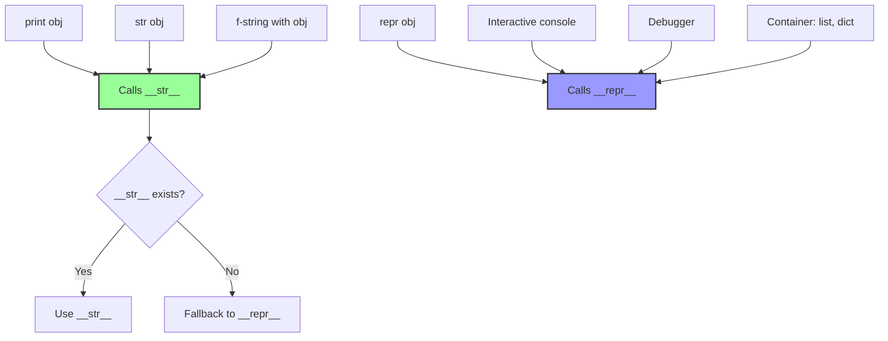
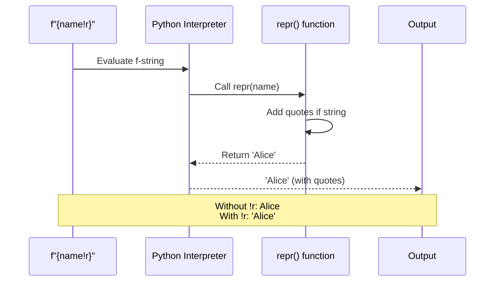
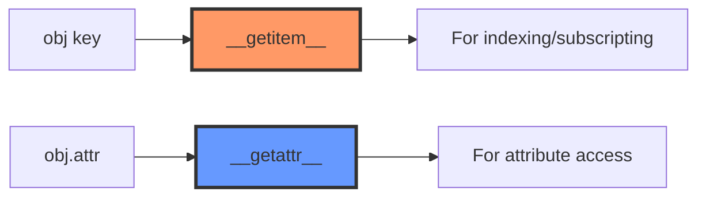
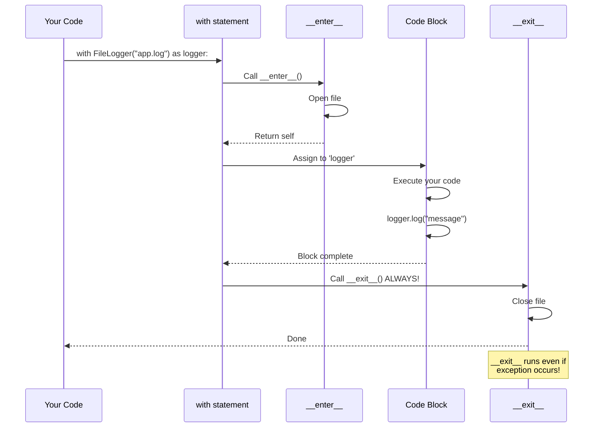
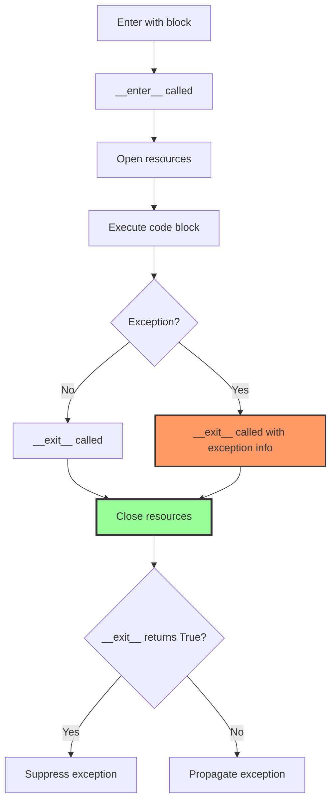
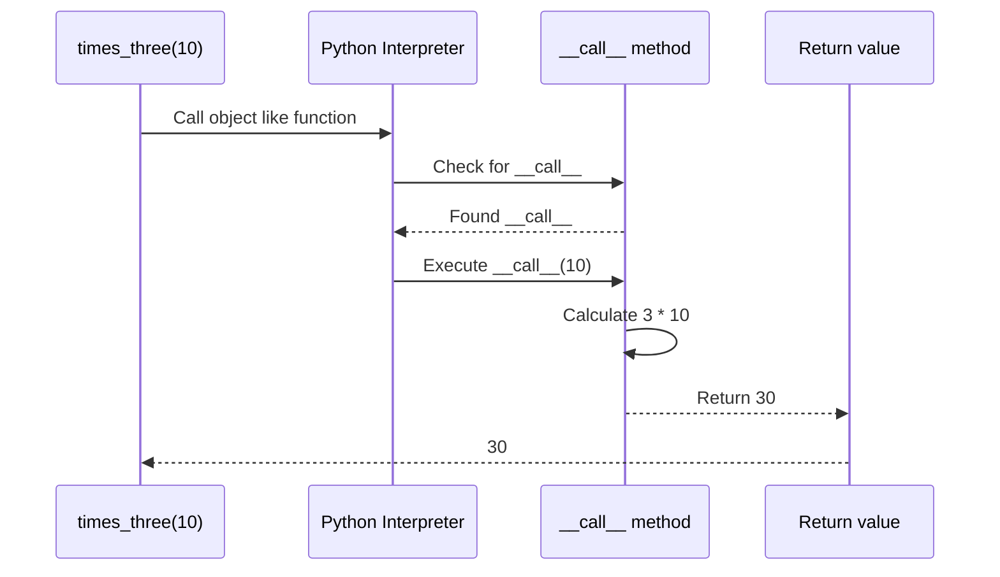
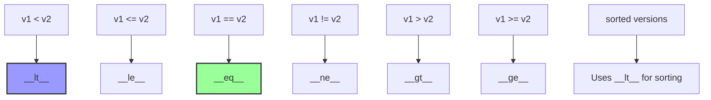
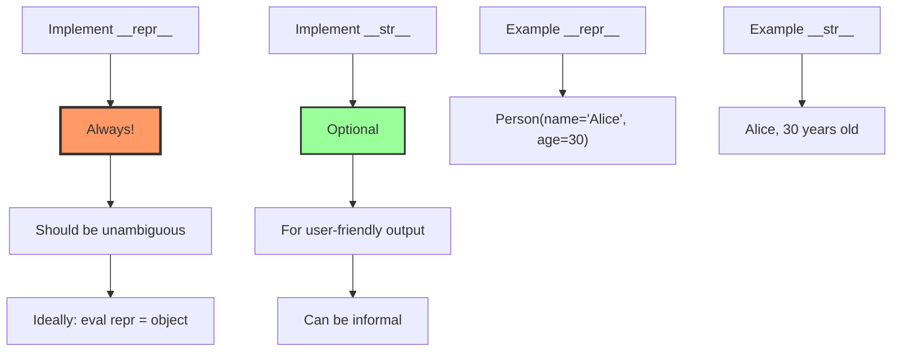
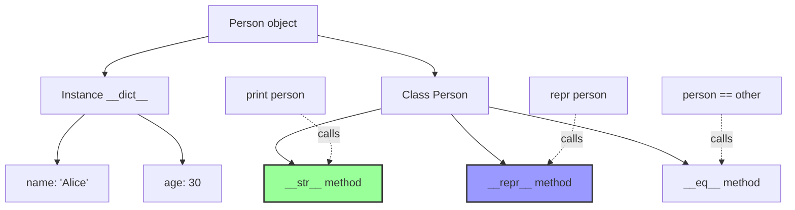

# Lesson 06: Magic Methods (Dunder Methods)

## 📚 Concept

Magic methods (also called dunder methods for "double underscore") are special methods in Python that start and end with double underscores (`__method__`). They allow you to define how objects behave with built-in operations like printing (`__str__`), comparison (`__eq__`), indexing (`__getitem__`), and resource management (`__enter__`, `__exit__`). These methods are called automatically by Python when you use operators or built-in functions, enabling your custom classes to integrate seamlessly with Python's syntax.

## 🎯 Key Points

- **__str__**: For end users - human-readable output (called by `print()`, `str()`)
- **__repr__**: For developers - unambiguous representation (called by `repr()`, console, debugger)
- **__getitem__**: For indexing with brackets `obj[key]` (not dot notation!)
- **__getattr__**: For attribute access with dot `obj.attr` (only when attribute not found)
- **__enter__/__exit__**: For context managers (`with` statement) - automatic resource cleanup
- **!r format specifier**: Calls `repr()` on values - adds quotes to strings
- **Fallback behavior**: If only `__repr__` exists, `str()` uses it; containers always use `__repr__`

## 💡 When to Use

- **__str__ and __repr__**: Make objects printable and debuggable - implement `__repr__` for all classes
- **__getitem__/__setitem__**: Create custom containers like `playlist[0]`, `config['database']`
- **__enter__/__exit__**: Manage resources (files, connections, locks) that need cleanup
- **__call__**: Make objects callable like functions - useful for decorators, callbacks, stateful functions
- **__eq__, __lt__, etc.**: Enable sorting and comparison of custom objects

## 🔍 Example Overview

The `example.py` demonstrates essential magic methods:

- **Example 1**: __str__ vs __repr__ - Clear distinction with !r format specifier
- **Example 2**: Fallback behavior - What happens without these methods
- **Example 3**: Container methods - __len__, __getitem__, __setitem__, __delitem__, __contains__, __iter__
- **Example 3b**: Attribute access - __getattr__, __setattr__, __delattr__ (different from __getitem__!)
- **Example 4**: Callable objects - __call__ to make objects behave like functions
- **Example 5**: Comparison methods - __eq__, __lt__, __le__, __gt__, __ge__ for sorting
- **Example 6**: Context managers - __enter__ and __exit__ for automatic resource management

## 🎬 What Happens Behind the Scenes?

### __str__ vs __repr__: When Each is Called



### !r Format Specifier Explained



### __getitem__ vs __getattr__: Different Purposes



**Key difference:**
- `playlist[0]` → `__getitem__(0)` - Brackets for indexing
- `config.database` → `__getattr__('database')` - Dot for attributes

### Context Manager Flow: __enter__ and __exit__



### Context Manager with Exception



**Critical**: `__exit__` is ALWAYS called, even if exception occurs!

### __call__: Making Objects Callable



### Comparison Methods Chain



### __str__ and __repr__ Best Practices



### Attribute Access vs Item Access

| Operation | Magic Method | Use Case |
|-----------|-------------|----------|
| `obj[key]` | `__getitem__` | Indexing, subscripting |
| `obj[key] = val` | `__setitem__` | Setting by index |
| `del obj[key]` | `__delitem__` | Deleting by index |
| `obj.attr` | `__getattr__` | Dynamic attributes (only if not found) |
| `obj.attr = val` | `__setattr__` | ALL attribute assignments |
| `del obj.attr` | `__delattr__` | Deleting attributes |

### Context Manager Use Cases

**Common patterns:**
```python
# File handling
with open('file.txt') as f:
    # __enter__ opens file
    data = f.read()
    # __exit__ closes file

# Database connections
with db.connection() as conn:
    # __enter__ connects
    conn.execute(query)
    # __exit__ disconnects

# Locks
with lock:
    # __enter__ acquires lock
    critical_section()
    # __exit__ releases lock
```

### Step-by-Step: Context Manager Execution

When you write `with FileLogger("app.log") as logger:`:

1. **Create object**: `FileLogger("app.log")` instantiated
2. **Call __enter__**: Opens file, returns self
3. **Assign to variable**: `logger = return_value_of_enter`
4. **Execute block**: Your code runs
5. **Call __exit__**: Closes file (ALWAYS, even with exceptions!)

### Memory Structure: Magic Methods



## 🚀 Run the Example

```bash
python lessons/06_magic_methods/example.py
```

## 📖 Further Reading

- [Python Data Model - Special Method Names](https://docs.python.org/3/reference/datamodel.html#special-method-names)
- [Context Managers and the with Statement](https://docs.python.org/3/reference/compound_stmts.html#with)
- [PEP 343 - The "with" Statement](https://peps.python.org/pep-0343/)
- [String Conversion - __str__ vs __repr__](https://docs.python.org/3/reference/datamodel.html#object.__repr__)
- **Real-world usage**: File objects use `__enter__`/`__exit__`, NumPy arrays use `__getitem__` for slicing, SQLAlchemy models use `__repr__` for debugging, decorators often use `__call__`
