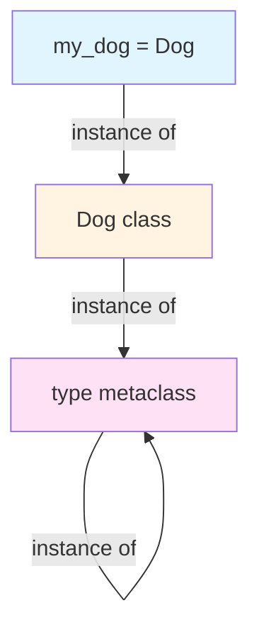
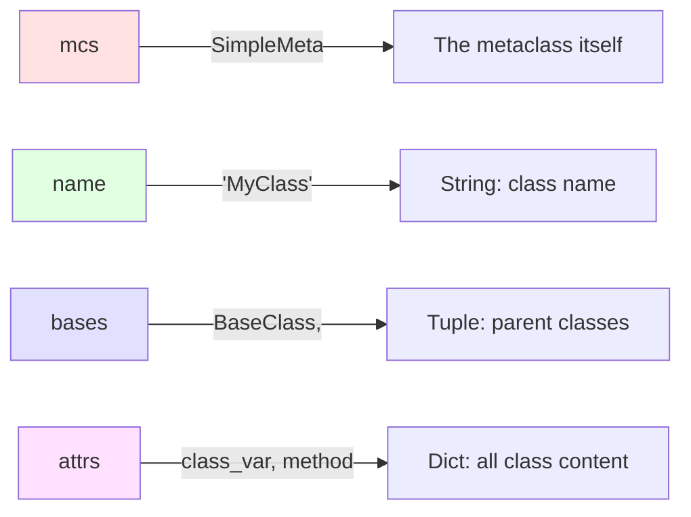
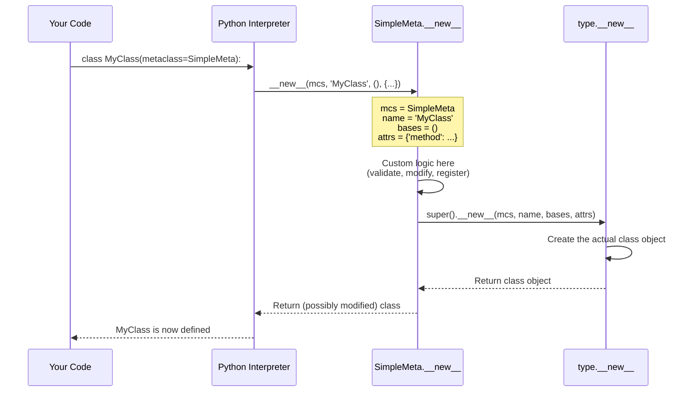
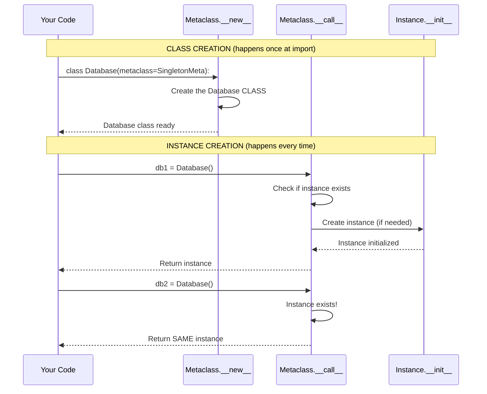
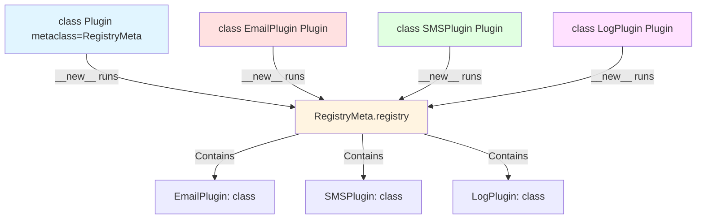

# Lesson 07: Metaclasses

## 📚 Concept

A metaclass is a "class of a class" that controls how classes are created. Just like classes define how instances behave, metaclasses define how classes behave. In Python, `type` is the default metaclass that creates all classes. When you need to customize class creation (auto-registration, validation, singleton pattern), you create a custom metaclass by inheriting from `type`.

## 🎯 Key Points

- **Classes are objects too** - Every class is an instance of `type` (the default metaclass)
- **Metaclasses inherit from type** - Custom metaclasses extend `type` to control class creation
- **__new__ vs __call__** - `__new__` runs when the class is defined, `__call__` runs when you create instances
- **Use sparingly** - Metaclasses are powerful but complex; use them only when simpler solutions don't work
- **Common use cases** - Plugin registries, enforcing coding standards, singleton pattern, ORM frameworks

## 💡 When to Use

- **Plugin systems** - Automatically register all plugin classes without manual registration
- **Validation frameworks** - Enforce rules on class definitions (e.g., all methods must have docstrings)
- **Singleton pattern** - Ensure only one instance of a class exists across the application
- **ORM libraries** - Django/SQLAlchemy use metaclasses to convert class definitions into database tables

## 🔍 Example Overview

The example.py demonstrates metaclasses through 6 progressive examples:

- **Example 1**: Classes are objects - Shows that `type(Dog)` is `type`
- **Example 2**: Dynamic class creation - Using `type(name, bases, dict)` to create classes
- **Example 3**: Basic custom metaclass - SimpleMeta that prints during class creation
- **Example 4**: Auto-registry pattern - RegistryMeta automatically registers plugin classes
- **Example 5**: Enforce rules - StrictMeta validates all methods have docstrings
- **Example 6**: Singleton pattern - SingletonMeta ensures only one instance exists

## 🎬 What Happens Behind the Scenes?

### The Metaclass Hierarchy



Everything in Python is an object, even classes! The `type` metaclass is special - it's an instance of itself.

### Understanding __new__ Parameters

When you write:

```python
class MyClass(BaseClass, metaclass=SimpleMeta):
    class_var = 42
    
    def method(self):
        pass
```

Python calls: `SimpleMeta.__new__(mcs, name, bases, attrs)`



**Parameter breakdown:**

| Parameter | Type | Example Value | Description |
|-----------|------|---------------|-------------|
| `mcs` | type | `SimpleMeta` | The metaclass itself (like `cls` in regular classes) |
| `name` | str | `'MyClass'` | The name of the class being created |
| `bases` | tuple | `(BaseClass,)` | Tuple of parent classes (empty tuple if no parents) |
| `attrs` | dict | `{'class_var': 42, 'method': <function>}` | Dictionary of all class attributes and methods |

### Class Creation Flow with Metaclass



**Step-by-step breakdown:**

1. **Python encounters class definition** - Sees `class MyClass(metaclass=SimpleMeta):`
2. **Collects class information** - Gathers name (`'MyClass'`), bases (`()`), and attrs (`{...}`)
3. **Calls metaclass.__new__** - Invokes `SimpleMeta.__new__(mcs, 'MyClass', (), {...})`
4. **Custom logic runs** - Your metaclass can inspect/modify the class before it's created
5. **Calls type.__new__** - `super().__new__()` actually creates the class object
6. **Returns class** - The new class is returned and assigned to `MyClass`

### __new__ vs __call__ in Metaclasses



**Key difference:**

- **__new__**: Runs when `class Database` is defined (once, at import time) - Controls CLASS creation
- **__call__**: Runs when `Database()` is called (every time) - Controls INSTANCE creation

This is why Singleton uses `__call__` - it needs to intercept every attempt to create an instance.

### Registry Pattern Visualization



Every time a class with `RegistryMeta` is defined, the metaclass automatically adds it to the registry. No manual registration needed!

### What attrs Dictionary Contains

When creating this class:

```python
class MyClass(metaclass=SimpleMeta):
    class_var = 42
    
    def method(self):
        return "hello"
```

The `attrs` parameter in `__new__` looks like:

```python
attrs = {
    '__module__': '__main__',
    '__qualname__': 'MyClass',
    'class_var': 42,
    'method': <function method at 0x...>
}
```

You can inspect, modify, add, or remove items before the class is created!

## 🚀 Run the Example

```bash
python lessons/07_class_vs_instance_metaclasses/example.py
```

## 📖 Further Reading

- [Python Data Model - Metaclasses](https://docs.python.org/3/reference/datamodel.html#metaclasses)
- [PEP 3115 - Metaclasses in Python 3](https://www.python.org/dev/peps/pep-3115/)
- [type() documentation](https://docs.python.org/3/library/functions.html#type)
- Real-world usage: Django ORM uses metaclasses to convert model classes into database tables
- Real-world usage: SQLAlchemy uses metaclasses for declarative base classes
